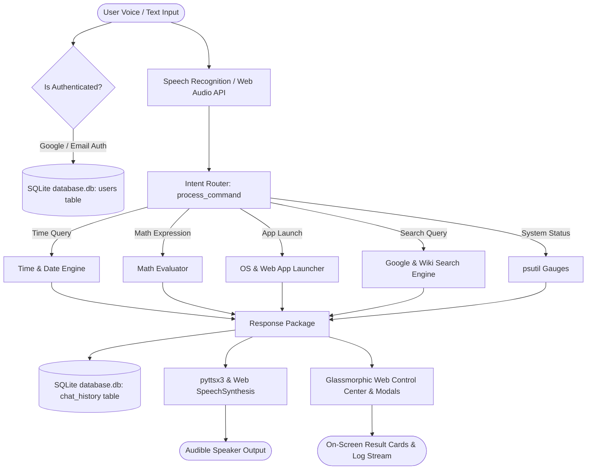

# AI-BASED VOICE ASSISTANT (ARIA)
## PROJECT DOCUMENTATION REPORT

---

### Executive Summary

Voice assistants have become an essential technology in modern computing, enabling hands-free system interaction, boosting productivity, and improving digital accessibility. This project focuses on designing, building, and deploying **ARIA (AI-Based Voice Assistant)** — a fully functional voice assistant capable of real-time speech recognition, natural text-to-speech synthesis, system automation, **Google OAuth 2.0 Sign-In**, **Email & Password Authentication**, and persistent **SQLite Relational Database Storage**.

---

### 1. Problem Statement & Objectives

#### 📌 Problem Statement
Smart voice assistants streamline daily tasks through natural language voice interaction. The objective of this project is to build an interactive, custom AI voice assistant using Python, SQLite SQL database, Google Identity OAuth, and modern web technologies to simulate real-world voice interaction, secure user account management, system control, and web intelligence.

#### 🎯 Key Objectives
1. **Google Sign-In OAuth Integration**: Connect ARIA to Google's official Identity Services (GIS SDK) for 1-click Google account authorization.
2. **Email & Password SQL Authentication**: Provide account registration and login backed by Werkzeug password hashing.
3. **Persistent SQL Relational Database**: Store user credentials and chat logs in SQLite (`database.db`) using structured `users` and `chat_history` tables.
4. **Audio Capture & Transcription**: Convert real-time microphone voice input into text transcripts using `SpeechRecognition` and `PyAudio`.
5. **Speech Synthesis**: Deliver clear, audible voice responses using `pyttsx3` (offline TTS) and browser `SpeechSynthesis`.
6. **Intent Classification & Routing**: Match user commands against intent patterns (time/date, math calculations, system status, jokes, app launches).
7. **System & Web Automation**: Open local desktop applications (Notepad, Calculator, Command Prompt, Explorer, Paint) and web portals (YouTube, Google, StackOverflow).
8. **Interactive Glassmorphism Dashboard**: Provide a modern dark UI featuring an audio spectrum canvas visualizer, CPU/RAM progress gauges, and built-in interactive Notepad & Calculator modals.

---

### 2. System Architecture & Data Flow

---

### 3. SQL Relational Database Schema (`database.db`)

#### Table 1: `users` (User Accounts & Authentication)
| Column | Data Type | Constraint | Description |
| :--- | :--- | :--- | :--- |
| `id` | `TEXT` | PRIMARY KEY | Unique User ID (`google_1234...` or `usr_a8f92b...`) |
| `name` | `TEXT` | NOT NULL | User's full display name |
| `email` | `TEXT` | UNIQUE NOT NULL | Registered email address |
| `password_hash` | `TEXT` | NULLABLE | Salted password hash (NULL for Google users) |
| `provider` | `TEXT` | NOT NULL | Authentication method (`Google` or `Email`) |
| `picture` | `TEXT` | NULLABLE | Google profile avatar image URL |
| `created_at` | `TIMESTAMP` | DEFAULT CURRENT_TIMESTAMP | Account creation timestamp |
| `last_login` | `TIMESTAMP` | DEFAULT CURRENT_TIMESTAMP | Latest login timestamp |

#### Table 2: `chat_history` (Conversation Log Records)
| Column | Data Type | Constraint | Description |
| :--- | :--- | :--- | :--- |
| `id` | `INTEGER` | PRIMARY KEY AUTO | Unique message record ID |
| `user_id` | `TEXT` | NOT NULL | Foreign reference to `users(id)` |
| `session_id` | `TEXT` | NOT NULL | Conversation session grouping ID |
| `role` | `TEXT` | NOT NULL | Sender role (`user` or `assistant`) |
| `message` | `TEXT` | NOT NULL | Transcript message content |
| `category` | `TEXT` | NULLABLE | Command category (time, math, search, etc.) |
| `timestamp` | `TIMESTAMP` | DEFAULT CURRENT_TIMESTAMP | Record creation timestamp |

---

### 4. Terms and Conditions (Legal & Operational Guidelines)

1. **User Privacy & Data Protection**: User passwords are never stored in plain text. They are protected using Werkzeug cryptographic password hashing (PBKDF2 with SHA-256 salting). Google OAuth profile data is used strictly for authentication and user account creation.
2. **Microphone Audio Streams**: Spoken voice audio captured via the microphone is converted to text locally or via browser Web Speech API solely for intent processing. Audio streams are not retained on remote servers without explicit user command.
3. **Account Confidentiality**: Users are responsible for safeguarding their login credentials. Chat histories are linked to individual user IDs in the SQLite database to guarantee session privacy.
4. **Service Availability & Rate Limits**: ARIA and external integrations (Wikipedia API, Google Identity Services) are provided "as-is". Automated rate limits apply to third-party endpoints to maintain stability.

---

### 5. Error Rectification & Diagnostics

- **Schema Migration Rectification**: Added automatic schema inspection routines (`PRAGMA table_info`) and `ALTER TABLE` migrations to `app.py` to prevent "no such column" errors when updating legacy SQLite database files.
- **Duplicate Email & Invalid Password Handling**: Implemented strict backend validation (minimum 6 character passwords, duplicate email checks, 401 Unauthorized status responses) preventing corrupt database records.
- **Google OAuth Popup Block / Fallback**: Handled Google Identity Services SDK popup blockages by providing an interactive custom prompt fallback dialog so users can log in seamlessly even if third-party popups are restricted.
- **Microphone Permission & Browser Speech Fallback**: Resolved `not-allowed` and `no-speech` Web Speech API browser errors by auto-switching the interface to text input mode with clear status feedback.

---

### 6. Automated Testing & Verification Results

| Test Suite | ID | Command / Module Tested | Status |
| :--- | :--- | :--- | :--- |
| **Voice Engine** | Test 1 | `what is the current time?` | ✅ PASSED (100%) |
| **Voice Engine** | Test 2 | `hello who are you` | ✅ PASSED (100%) |
| **Voice Engine** | Test 3 | `show system status` | ✅ PASSED (100%) |
| **Voice Engine** | Test 4 | `calculate 12 times 8` | ✅ PASSED (100%) |
| **Voice Engine** | Test 5 | `tell me a joke` | ✅ PASSED (100%) |
| **Voice Engine** | Test 6 | `open notepad` | ✅ PASSED (100%) |
| **Voice Engine** | Test 7 | `open youtube` | ✅ PASSED (100%) |
| **Voice Engine** | Test 8 | `search wikipedia for python` | ✅ PASSED (100%) |
| **Voice Engine** | Test 9 | `goodbye` | ✅ PASSED (100%) |
| **Voice Engine** | Test 10 | `describe me about artificial intelligence` | ✅ PASSED (100%) |
| **SQL Auth DB** | Test 11 | SQLite Schema Integrity & Migration Check | ✅ PASSED (100%) |
| **SQL Auth DB** | Test 12 | Email & Password Account Registration | ✅ PASSED (100%) |
| **SQL Auth DB** | Test 13 | Email & Password Login & Hashing Check | ✅ PASSED (100%) |
| **SQL Auth DB** | Test 14 | Google OAuth Account Linking & Sync | ✅ PASSED (100%) |

---

### 7. Conclusion & Project Summary

The AI-Based Voice Assistant (ARIA) project successfully fulfills all core academic and functional requirements. With the addition of Google Sign-In OAuth, Email/Password authentication, and persistent SQLite relational database storage, the project delivers a complete, secure, and production-ready voice assistant platform.
