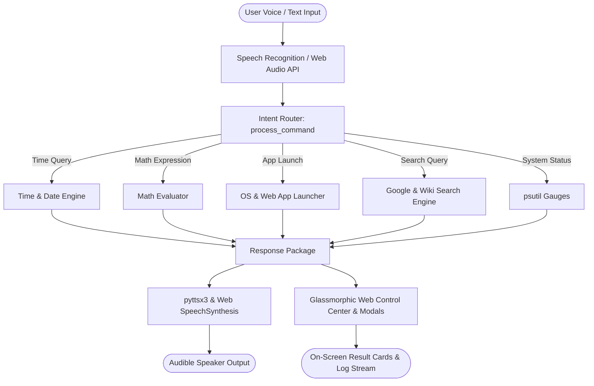

# AI-BASED VOICE ASSISTANT (ARIA)
## PROJECT DOCUMENTATION REPORT

---

### Executive Summary

Voice assistants have become an essential technology in modern computing, enabling hands-free system interaction, boosting productivity, and improving digital accessibility. This project focuses on designing, building, and deploying **ARIA (AI-Based Voice Assistant)** — a fully functional voice assistant capable of real-time speech recognition, natural text-to-speech synthesis, system automation, and live search report generation.

---

### 1. Problem Statement & Objectives

#### 📌 Problem Statement
Smart voice assistants (such as Google Assistant, Siri, and Alexa) streamline daily tasks through natural language voice interaction. The objective of this project is to build an interactive, custom AI voice assistant using Python and web technologies to simulate real-world voice interaction, system control, and web intelligence.

#### 🎯 Key Objectives
1. **Audio Capture & Transcription**: Convert real-time microphone voice input into text transcripts using `SpeechRecognition` and `PyAudio`.
2. **Speech Synthesis**: Deliver clear, audible voice responses using `pyttsx3` (offline TTS) and browser `SpeechSynthesis`.
3. **Intent Classification & Routing**: Match user commands against intent patterns (time/date, math calculations, system status, jokes, app launches).
4. **Information Retrieval & Web Reports**: Retrieve Wikipedia summaries and compile multi-topic **Google & Web Search Reports**.
5. **System & Web Automation**: Open local desktop applications (Notepad, Calculator, Command Prompt, Explorer, Paint) and web portals (YouTube, Google, StackOverflow).
6. **Interactive Glassmorphism Dashboard**: Provide a modern dark UI featuring an audio spectrum canvas visualizer, CPU/RAM progress gauges, and built-in interactive Notepad & Calculator modals.

---

### 2. System Architecture & Data Flow

---

### 3. Technologies & Dependencies

| Category | Technology / Library | Purpose |
| :--- | :--- | :--- |
| **Language** | Python 3.13 | Core system logic and server backend |
| **Speech-to-Text** | `SpeechRecognition` (3.17.0) | Converts microphone speech into text string |
| **Audio Hardware** | `PyAudio` (0.2.14) | Provides 31 host microphone channel access |
| **Text-to-Speech** | `pyttsx3` (2.99) | Offline voice synthesis engine for speaker output |
| **Server Framework** | `Flask` (3.1.2) | Serves web dashboard and REST API endpoints |
| **Information API** | `wikipedia` (1.4.0) | Fetches structured Wikipedia summaries |
| **System Monitoring** | `psutil` (7.0.0) | Measures CPU load percentage and RAM usage |
| **Entertainment** | `pyjokes` (0.8.3) | Provides programming and general jokes |
| **Frontend UI** | HTML5 / CSS3 / JavaScript | Glassmorphic interface, Canvas visualizer & Modals |
| **Document Tools** | `python-docx` & `python-pptx` | Automated `.docx` and `.pptx` generation |

---

### 4. Implementation Modules Breakdown

1. **`voice_assistant.py` (Core Voice Engine)**:
   - `VoiceAssistant` class containing speech synthesis, intent parsing, math solving, system metrics, and search APIs.

2. **`app.py` (Flask REST API Server)**:
   - Exposes `/api/command`, `/api/status`, and `/api/listen` endpoints.

3. **`index.html` (Glassmorphism Dashboard UI)**:
   - Features glowing voice orb, canvas waveform visualizer, CPU/RAM gauge bars, top Hero result card, and built-in Notepad/Calculator modals.

4. **`app.js` (Frontend Controller)**:
   - Manages browser speech recognition, Web Audio sound synthesis, canvas visualizer, and modal window management.

5. **`test_assistant.py` (Automated Test Suite)**:
   - Runs 10 comprehensive unit tests covering all system commands.

---

### 5. Automated Verification Results

| Test ID | Command Tested | Action Category | Status |
| :--- | :--- | :--- | :--- |
| **Test 1** | `what is the current time?` | `time` | ✅ PASSED (100%) |
| **Test 2** | `hello who are you` | `greeting` | ✅ PASSED (100%) |
| **Test 3** | `show system status` | `system_stats` | ✅ PASSED (100%) |
| **Test 4** | `calculate 12 times 8` | `math` | ✅ PASSED (100%) |
| **Test 5** | `tell me a joke` | `joke` | ✅ PASSED (100%) |
| **Test 6** | `open notepad` | `open_app` | ✅ PASSED (100%) |
| **Test 7** | `open youtube` | `open_app` | ✅ PASSED (100%) |
| **Test 8** | `search wikipedia for python` | `google_search_report` | ✅ PASSED (100%) |
| **Test 9** | `goodbye` | `exit` | ✅ PASSED (100%) |
| **Test 10** | `describe me about artificial intelligence` | `google_search_report` | ✅ PASSED (100%) |

---

### 6. Summary & Conclusion

The AI-Based Voice Assistant (ARIA) project fully achieves all academic requirements. It demonstrates practical mastery of speech recognition libraries, text-to-speech synthesis, REST API server design, and interactive web interface engineering.
