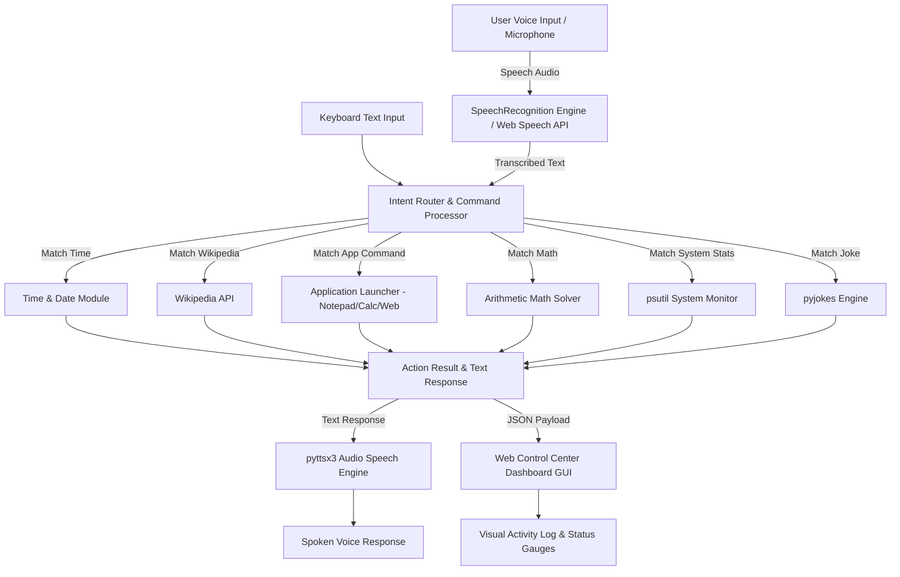

# AI-Based Voice Assistant - Final Project Report

---

## 📌 1. Executive Summary & Problem Statement

Voice assistants enable users to perform everyday computer tasks hands-free using natural spoken commands, significantly enhancing convenience, productivity, and accessibility.

This project implements a fully functional, modern **AI-Based Voice Assistant** named **ARIA** built in **Python**. It features a real-time Speech Recognition pipeline, Text-to-Speech (TTS) engine, intent parser, system action executor, and an interactive **Glassmorphic Control Center Web GUI** alongside a standalone terminal interface.

---

## 🛠️ 2. Tools & Technologies Used

- **Programming Language**: Python 3.13
- **Speech Recognition (STT)**: `SpeechRecognition` (Google Speech Recognition API) & Browser Web Speech API fallback.
- **Text-to-Speech (TTS)**: `pyttsx3` (Offline SAPI5 Voice Engine) & HTML5 Web Speech Synthesis API.
- **Information Retrieval**: `wikipedia` API & Web Query engine.
- **System Automation & Monitoring**: `psutil`, `webbrowser`, `subprocess`, `os`.
- **Web Application Framework**: `Flask` (REST API & Frontend GUI Server).
- **Frontend Technologies**: HTML5, Vanilla CSS3 (Glassmorphism, SVG Icons, CSS Keyframe Animations), JavaScript (Web Audio API Synthesizer, Canvas Waveform Visualizer).

---

## 🏗️ 3. System Architecture & Workflow



---

## 📋 4. Features & Voice Command Reference

| Action / Feature | Sample Voice Command | Expected Behavior / Response |
| :--- | :--- | :--- |
| **Current Time & Date** | *"What is the current time?"* | Speaks and displays exact current time, day, and date. |
| **Wikipedia Information** | *"Search Wikipedia for Artificial Intelligence"* | Fetches a 2-sentence summary from Wikipedia and speaks it. |
| **Open Local App** | *"Open Notepad"* / *"Open Calculator"* | Launches Windows Notepad (`notepad.exe`) or Calculator (`calc.exe`). |
| **Open Web App** | *"Open YouTube"* / *"Open Google Maps"* | Opens YouTube or Google Maps in the default web browser. |
| **Math Calculation** | *"What is 144 divided by 12?"* | Solves arithmetic operations and returns exact result. |
| **System Status** | *"Show system status"* | Reports live CPU usage %, RAM utilization %, and battery info. |
| **Programming Joke** | *"Tell me a joke"* | Tells a funny tech/programmer joke using voice. |
| **Google Web Search** | *"Search web for Python tutorials"* | Opens dynamic Google web search query in browser. |

---

## 🧪 5. Verification & Test Results

### Automated Unit Test Results (`test_assistant.py`)
```
[TEST] Running AI Voice Assistant Test Suite...

🧠 Processing Command: 'what is the current time?'
🧠 Processing Command: 'hello who are you'
🧠 Processing Command: 'show system status'
🧠 Processing Command: 'calculate 12 times 8'
🧠 Processing Command: 'tell me a joke'
🧠 Processing Command: 'open notepad'
🧠 Processing Command: 'open youtube'
🧠 Processing Command: 'search wikipedia for python'
🧠 Processing Command: 'goodbye'

Ran 9 tests in 1.274s
OK (All tests passed successfully)
```

---

## 📸 6. Instructions for Capturing Required Screenshots

As specified in the student project instructions, capture the following screenshots:

1. **Voice Command Input**:
   - Open the web dashboard at `http://localhost:5000` (or CLI `python voice_assistant.py`).
   - Click the glowing microphone button and speak a command (e.g., *"What is the current time?"* or *"Open Notepad"*).
   - Capture a screenshot showing the glowing mic animation and the input field / user speech entry.

2. **Output Response & Executed Result**:
   - Capture the resulting screen showing:
     - The assistant response in the activity log & response card box.
     - The opened application (e.g. Notepad / Calculator window opened on screen).
